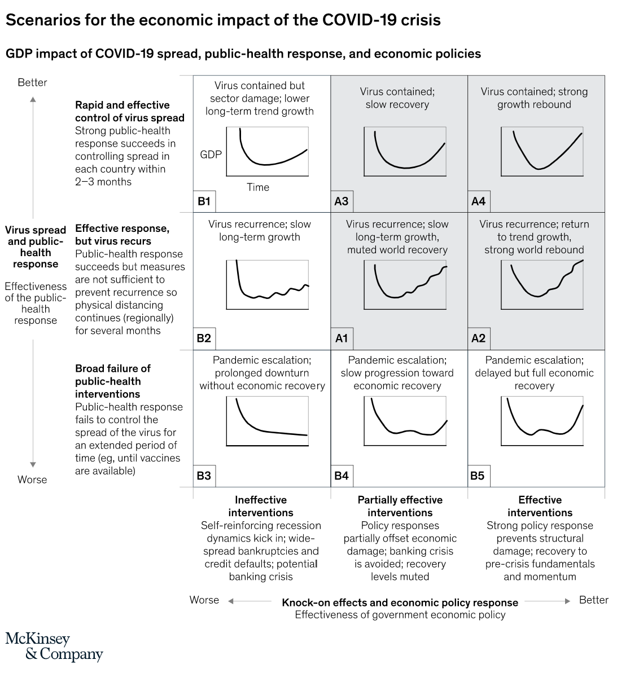

```{r setup, include=FALSE}
knitr::opts_chunk$set(echo = TRUE)
```

## Background

This is an analysis of ASRS cash flow considering a stressed scenario of a sharp stock market decline.  It considers external cash flows from pension obligations and internal cash flows induced by capital calls from partners in credit and real estate. The purpose of the analysis is to determine the robustness of the current investment structure and commitments to this stress.  An excel spreadsheet is provided and this paper documents the process and conclusions.

## Description of the model

The model starts with **Market Assumptions**.  We treat the market as stock market.  We use SPX reference as representing the entire stock market.  You can change this to whatever you want -- what matters is the relative changes in value over time.  We then present mechanics for estimating appraisal effects on the private market portfolio.  March 31 value estimates will not be known to us for 60 to 90 days.  So, we make an assumption on the value adjustments for March 31.  We then further adjust for assumed "sensitivity" to stock market changes.  So, if you assume that an asset has 50% sensitivity and the stock market goes down 10%, that asset would be modeled to go down 5%.  

Next are representations of the **Balance Sheet** holdings.  First, "nominal" values are presented as of March 31, 2020 (estimated for now as the March 30 values).  We then present a "revalued" balance sheet that takes in to account the anticipated appraisal adjustments as described above.

The **Leverage Analysis** shows leverage incurred both absolute (bonds+cash < 0) and relative a floor value on bonds+cash of $1 billion.

The **Positioning** section shows the portfolio compared to target SAA positions in percentage and dollar terms.

The **Cash Flow** section shows external cash flows (net pension payments) and internal cash flows from capital calls and rebalancing decisions.  

The **Cash Flow Assumptions** section provides cash flow assumptions provided by the credit and real estate portfolio managers.  

## Economic and market assumptions for the model

The assumptions used in the model are **not** intended as a forecast, but merely a plausible scenario that is severe enough to constitute a stress test of the portfolio structure.  

This model is based on a deep recession from coronavirus impacts causing a steep decline in stocks.  The stock market (SPX) peaked in February at 3390 declined to about 2350 and at this writing sits at 2600.  We assume the stock market resumes a steep decline with bad virus news arriving much faster than any good news on tesging or treatment.   

The US scenario on infections and recovery will be less favorable than the China scenario because our legal and political system does not permit the kind of personal restrictions implemented and relies, instead, on cooperation of federal and local jurisdictions to encourage voluntary restraint.  Goldman Sachs is forecasting a 30% decline in economic activity in the second quarter as sa result of the disease.

The fiscal and monetary response to the crisis has been good and the financial and banking infrastructure has been resilient under considerable stress.  The crisis induced bi-partisan on a $2 trillion rescue package which will provide much help in avoiding what might have otherwise evolved to a situation of mass personal and business insolvency.  The fed has proactively and nimbly injected large quantities of liquidity where needed to unclog bottleknecks in the financial system and reduced bank borrowing costs to zero to mitigate contractions in credit.  There appears to be will to take additional action as needed in response to the crisis.

Mckinsey provides the following framework to understand the interaction of health and economic policy in shaping outcomes for the virus.  We may be in a scenario like that described in box "A2", i.e. a good approach to fiscal and monetary policy but a less perfect approach on virus containment.  This would result in a deep recession but halting recovery depending on how quickly the labor force is healthy enough to return to work with an adequate testing regime to know who is healthy and who isn't.




We have modeled the stock market declining to 1700 a total decline from prior peak of `r round(100*1500/3400)`% which is comparable to prior severe recessions.  (If we were doing a forecast instead of a stress test, this seems a bit overly pessimistic but we want to make sure to adequately stress the system for the current purposes.)

We then assume the stock market gradually recovers to a new normal of 3100, about 10% lower than the February peak.  We believed that the February peak was rich at the time because of much higher than historical norms for PE ratios both on a current earnings and cyclically adjusted earnings basis.  We think in the new normal, interest rates will be persistently low.  Monetary stimulus has lowered rates to historic lows and the ten year treasury is now about .6%.  The fiscal deficits which will be necessary for recover will substantially increase public debt to the point that it is difficult to envision a path leading to higher interest rates.  We anticipate future interest rates even lower than we would have expected two months ago and that those rates are more firmly rooted in place.  We then assume a go forward return of 5%, a bit higher than we might have forecast when were at the prior peak of 3400.  With ten year treasurys at perhaps at 1%, this is a 4% risk premium which we think is reasonable.  

We have modeled private equity with a sensitivity to stock pricing of 50%.  We believe that private equity will continue a premium but have not modeled any benefit from this for reasons of both conservatism and simplicity.

We have modeled credit with a sensitivity to stock returns of 50% which results in accounting write downs at the trough of about 25% before gradually recovering.  We believe private credit will remain attractive with long run returns as depicted in the most recent implementation plan.  In the near term credit returns (for new deals) will be very attractive due to both liqudity and higher risk premiums.  We have not modeled extra returns for this for reasons of conservatism and modeling simplicity.  

We have modeled real estate with a sensitivity to stock returns of 25% which results in accounting write downs at the trough of 12% before gradually recovering.  Stable real estate is a comparatively low risk asset with core bonds being the only thing we own that is less risky.  As markets stabilize and the credit system returns to normal we believe the market for stable real estate will be strong as investors look for relatively safe inflation protected yield.  With ultra low interest rates we think cap rates will be as low as and maybe even lower than pre-virus levels.   We believe Value add real estate will earn returns as depicted in the recent implementation plan with an interim period of significantly heightened returns as we experience higher risk and liquidity premiums from the recession.

## Portfolio assumptions

We have modeled our positioning in the stock market with the assumption that we will be exceptionally prescient on stock market moves, again in order to fulfill our stress testing requirement.  We assume that we sell another $800 million in stocks in April.  We then do a full rebalance when the market bottoms at 1700.  Based on the specific assumptions used, this requires $2.6 billion in cash to implement the rebalance.  Following the full rebalance, I then do a partial rebalance of 1/4 of whatever the prior over or under weight.

Credit is modeled using assumptions provided by its portfolio manager.  All reinvestment of income has been turned off in the credit portfolio thus mitigating capital calls.  No new strategies are included in the model although the model assumes upsize for a European direct lender as contemplated in the implementation plan.

Real estate is modeled using assumptions provided by RCLCO.  As previously discussed, RCLCO has delayed approximately $2 billion in new initiatives depicted in the implementation plan and approximately $300 million in pipeline transactions pending at the end of February have been cancelled or deferred (for likely renegotiation or cancellation if not renegotiated).  The model contemplates going forward with existing SMAs and funds.  The only new commitments included in the model are a $400 million upsizing with MCR and an additional $200 million with Related for a potential opportunistic investment in the distressedd Reit space.  We have modeled a rotation of the portfolio away from stable assets and towards risk assets.  We have identified about $800 million in assets (including the infrastructure investment with IFM) that can be sold and have assumed about half those sales will be completed in the next two years for redeployment in value creation scenarios. Real estate SMAs all include approvals at the individual transaction level and managing underwriting criteria is as or more important than commitment levels in understanding those accounts.  RCLCO has significantly stiffened underwriting criteria on projected future rents and vacancy periods in the current environment in order to focus on the most compelling opportunities.


## Results of the analysis

The analysis shows the ASRS investment structure is robust to a severe stock market down turn.  Modeling this structure with anticipated capital calls, we are able to accomplish a full rebalance requiring 2.6 billion of cash later this year inside the parameters of prudent portfolio positioning.  The modeled bond/cash balances never go below 1 billion and zero leverage is required to accomplish this.  The maximum underweight position in equities is -9% right before the big rebalance.  

I also ran an even more stressed scenario where capital calls from real estate and credit are $1 billion higher than the portfolio manageres believe will be the case.  In this case, we can still achieve a full rebalance with higher capitals and a 50% stock market decline with zero leverage although the bonds+cash are reduced to 700 million, which is below the 1 billion target minimum.  In this high capital call scenario, the portfolio is pushed out of balance relative to SAA with overweights of 5% in credit and 1% in real estate.  For modeling simplicity, I have funded these excess positions entirely from bonds+cash.  In the most recent implementation plans, we concluded it makes sense to be overweight credit and real estate because we believe we can earn higher returns in these asset classes compared to stocks (or a balanced portfolio of stocks and bonds).  If that is still the case after the current turmoil we can fund the excess credit and real estate positions from appropriate blend of stocks and bonds.  Otherwise we can engage in asset sales to return SAA targets.  Asset sales in real estate SMAs are acchievable in our discretion and at our direction.  In credit, we would (and believe we could) collaborate with our managers to achieve a smaller balance sheet.

I think it is worth emphasizing once again this is a stress model not a forecast.  The scenarios described are extreme.  The rebalance behavior described here is both more extreme and more prescient than would likely occur.  It is likely we would be much more incremental in the approach and extremely likely that we would be at least a little off in the timing.

Based on this analysis, I believe it is reasonable to conclude that there is no need at this time to make changes to the real estate and credit portfolios beyond what has already been done.  We will do a separate analysis for private equity to establish (likely reduced) commitment levels for the coming year.  We should update this analysis at least quarterly while markets are under stress in order to continuously reassess this conclusion.


